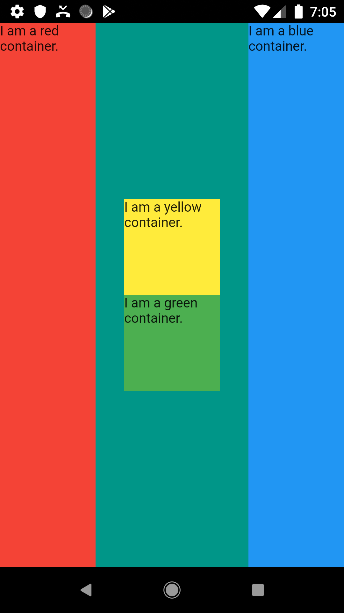
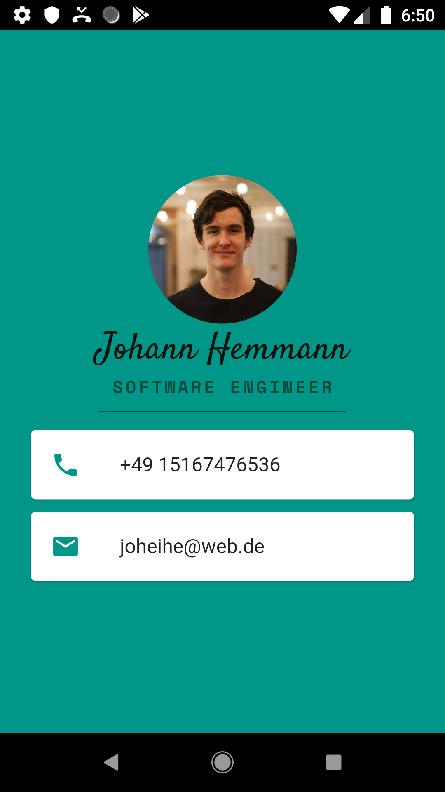

# hello_flutter

In this repo I will do and track all the exercises for AppBreweries "The Complete Flutter Development Bootcamp Using Dart".

**Table of content**
- [Steps](#steps)
  - [Flutter layout challenge](#flutter-layout-challenge)
  - [Business Card App](#business-card-app)

## Steps
Cause I want to keep the repo small I will only work on one main.dart file. To access the different exercise projects you need to travel to the respective commit.

### Flutter layout challenge
- commit: Build flutter layouts challenge app (from scratch) - eef8326b8e81eacec8b153478d6e0214bcec7761

### Business Card App
- commit: Business card improved solution - b596089fd0a37e2b4299766cabb8fdb18ac98322

